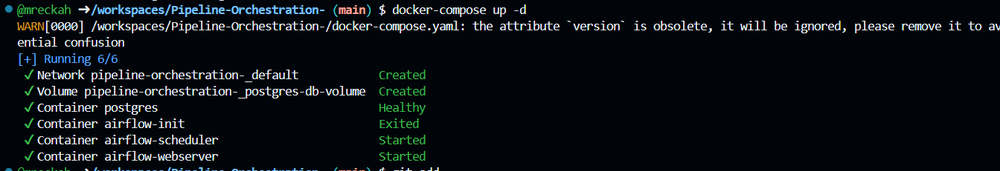
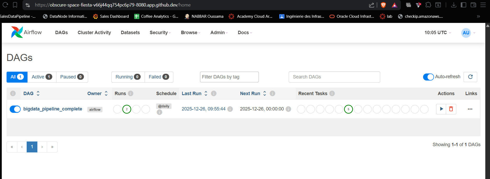
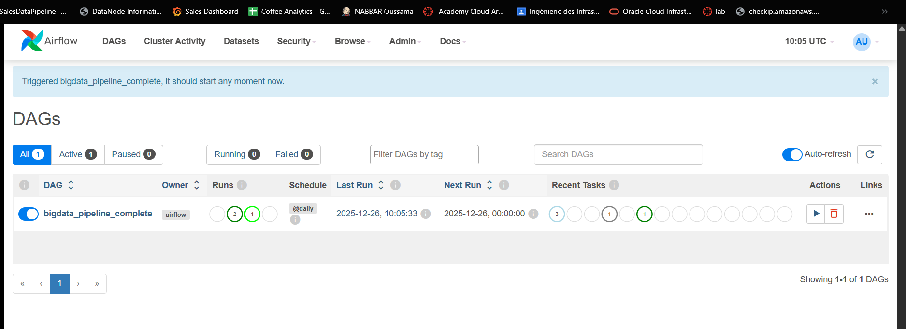
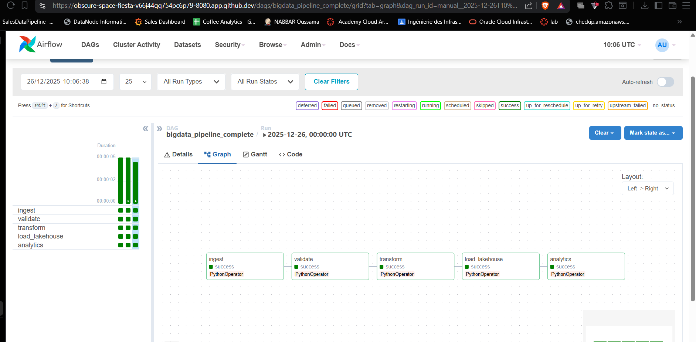
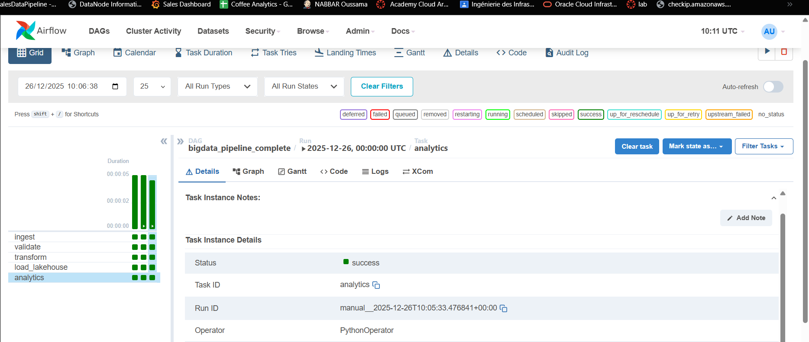
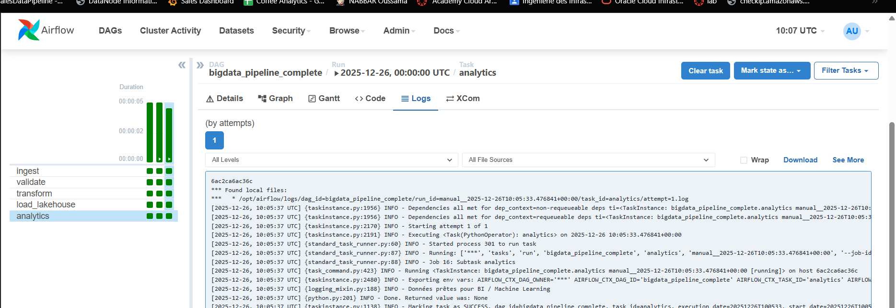
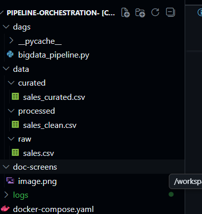

# Big Data Pipeline with Apache Airflow

A simple Big Data pipeline orchestrated with Apache Airflow, from data ingestion to analytics.

## Objective

Build a complete Big Data pipeline with Apache Airflow, covering all stages from ingestion to exploitation, with visual monitoring through the web interface.

## Pipeline Architecture

```
Sources → Ingestion → Data Lake (RAW) → Processing → Lakehouse (CURATED) → Analytics
```

- **Data Lake (RAW)**: Raw data storage
- **Processing**: Data cleaning and structuring
- **Data Lakehouse (CURATED)**: Analytics-ready data
- **Airflow**: Orchestration and monitoring

## Pipeline Workflow

**DAG Name**: `bigdata_pipeline_complete`

### Dependencies

```
ingest → validate → transform → load_lakehouse → analytics
```

## Starting the Pipeline



## Airflow Web Interface

**URL**: `http://localhost:8080`  
**Login**: airflow / airflow


## Execution via Airflow Interface

### 1. DAG Activation



### 2. Manual Trigger



### 3. Graph View

Visualize task dependencies and execution flow.



### 4. Execution Monitoring

- Green: Success
- Red: Failed
- Blue: Running



### 5. Log Inspection

View detailed logs for each task.



## Generated Outputs



## Conclusion

This workshop demonstrates how to build a simple Big Data pipeline, orchestrate steps with Apache Airflow, monitor execution via a web interface, and verify Data Lake and Data Lakehouse results. It provides an ideal foundation before moving to advanced Big Data pipelines with Spark, Hadoop, and BI tools.